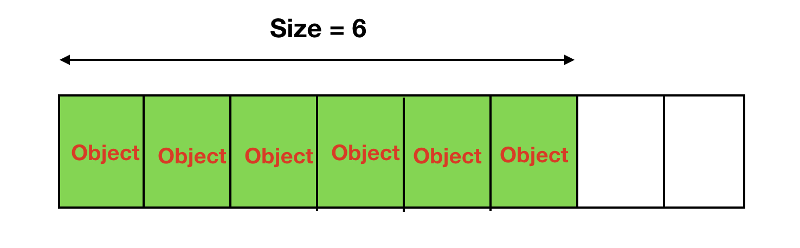
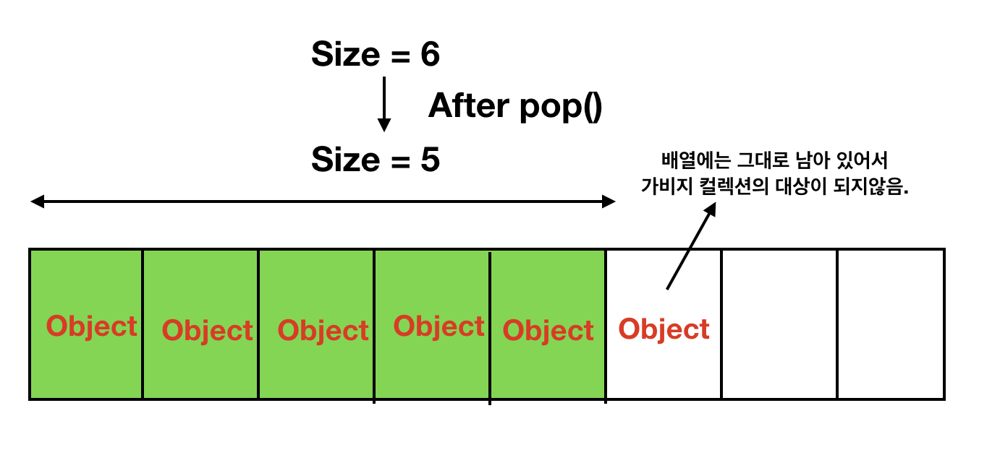

# 7. 다 쓴 객체 참조를 해제하라

* 자바는 GC에 의해 오랜 시간동안 참조되지 않은 메모리가 회수 된다.  
* 하지만 GC가 메모리를 회수하지 못하는 경우, 혹은 GC 자체에 문제가 생기는 경우가 있는데 이때 Memory Leak(메모리 누수)가 발생하고 지속될시엔 OOM(Out Of Memory)나 메모리를 할당할 수 없는 Can not allocate memory가 발생할 수 있다.  

### 메모리 누수 패턴

#### 1) 첫번째는 위에서 설명한 class내에서 instance에 대한 참조(reference)를 관리하는 객체이다.  
#### 2) 두번째는 Map과 같은 캐시  
#### 3) 세번째는 리스너(Listener) 혹은 콜백(Callback)    
#### 4) static 필드에서 객체 참조
##### static field에서 사용되는 변수는 부모 객체가 참조되지 않아도 GC 대상에 포함되지 않는다.  

#### 5) ThreadLocal에서 참조하는 객체들
###### 톰캣,웹로직등의 웹어플리케이션서버에서 ThreadLocal사용할 경우 로직이 종료되어도 GC가 안된다.   
######어플리케이션 쓰레드 내부에서는 ThreadLocal객체를 strong reference하기 때문에 앱의 lifecycle이 끝났으면 GC가 되어야 하지만 웹서버입장에서는  실제 thread를 생성한 것은 was이고, 여기서도 ThreadLocal 객체를 참조하고 있기 때문이다.    

##### * ThreadLocal이란?  
https://javacan.tistory.com/entry/ThreadLocalUsage

#### 6) String Literal
##### String이 코드에 ""로서 이미 포함되어있는 경우(String Literal) perm 영역에 위치하기 때문에 GC되지 않는다.  (String Constant Pool 내부에서 가지고 있어서 따로 그냥 GC대상이 아니다라고만 알고 있으면 될듯)  


## STACK Class의 메모리 누수

### 일반적인 STACK CODE
* 스택은 자기 메모리를 직접 관리한다.
* 배열의 활성영역에 속한 원소만 사용되고 비활성 영역은 쓰이지 않는다. (GC가 알 방법이 없다.)
* 비활성 영역이 되는 순간 Null 처리로 GC에게 알릴 때 사용한다.  

```java
public class Stack {

    private Object[] elements;
    private int size = 0;
    private static final int DEFAULT_INITIAL_CAPACITY = 16;

    public Object[] getElements() {
        return elements = new Object[DEFAULT_INITIAL_CAPACITY];
    }

    public void push(Object e) {
        ensureCapacity();
        elements[size++] = e;
    }

    public Object pop() {
        if (size == 0)
            throw new EmptyStackException();
        return elements[--size];
    }

    private void ensureCapacity() {
        if (elements.length == size) {
            elements = Arrays.copyOf(elements, 2 * size + 1);
        }
    }

}
```
  
일반적인 Stack 클래스이지만 내부적으로 메모리 누수 문제를 가지고 있다.  
** 어디서 메모리 누수가 일어 날까? ** 
바로 ** pop()** 메소드에서 일어나게 된다.  
가비지 컬렉션 입장에서 생각해보면, 제거된 객체는 아직 elements 배열에서 물고 있기 때문에, 마치 사용하고 있는 것 처럼 보인다.  
** Stack 클래스 **가 메모리 누수에 취약한 이유는 바로 스택이 자기 메모리를 직접 관리하기 때문이다.   
이 스택은 elements 배열로 저장소 풀을 만들어 원소들을 관리한다. 배열의 활성영역(즉 size 까지의 범위)들은 사용되고, 가비지 컬렉터가 보기에는 비활성 영역에서 참조하는 객체도 똑같이 유효한 객체다.  

  
  

* 비활성 영역이 되는 순간 null처리를 하여 GC에 해당 객체는 더 이상 사용하지 않을 것이다를 알려야한다.  


### 수정 pop() Method
```java
public Object pop() {
  if(size == 0)
    throw new EmptyStackException();
  Object result = elements[--size];
  elements[size] == null; // 다 쓴 참조 해제
  return result;
}
```
  
### 그렇다면 모든 객체에 항상 null 처리를 해야하나?
개발자는 자바에서 사용한 모든 객체에 null 처리를 반드시 해야할까?  
매번 null 처리를 반드시 할 필요가 없다. 이는 코드를 복잡하게 만들뿐이다. 객체 참조에 null 처리하는 일은 예외적인 경우에 해당한다.  
다 쓴 객체 참조를 해제하는 가장 좋은 방법은 참조를 유효 범위(scope) 밖으로 밀어내는 것이다.(전역 변수를 지양) 변수의 범위를 가능한 최소가 되게 정의한다.  


## 캐시 데이터에 의한 메모리 누수  

* 가비지 컬렉터에서는 논리적으로 더이상 사용하지 않는 객체에 대한 정리 작업을 실행한다. 하지만 만약 이러한 객체가 맵 안에 존재하고 있다면 어떻게 될까?  
```java
public class HashMapTest {
 
    public static void main(String[] args) {
        HashMap<Integer, String> map = new HashMap<>();
 
        Integer key1 = 1000;
        Integer key2 = 2000;
 
        map.put(key1, "test a");
        map.put(key2, "test b");
 
        key1 = null;
 
        System.gc();  //강제 Garbage Collection
 
        map.entrySet().stream().forEach(el -> System.out.println(el));
      	// 2000=test b
		// 1000=test a
    }
}
```

### WeakHashMap
#### Strong Reference

##### 우리가 흔히 사용하는 reference / String str = new String("abc"); 와 같은 형태
##### Strong Reference는 GC의 대상이 되지 않는다. Strong Reference관계의 객체가 GC가 되기 위해선 null로 초기화해
##### 객체에 대한 Reachability상태를 UnReachable 상태로 만들어 줘야 한다.  

#### Soft Reference

##### 객체의 Reachability가 Strongly Reachable 객체가 아닌 객체 중 Soft Reference만 있는 상태
##### SoftReference<Class> ref = new SoftReference<>(new String("abc"));와 같은 형태로 사용
##### Soft Reference는 대게 GC대상이 아니다가 out of memory에러가 나기 직전까지 가면 Soft Reference 관계에 있는 객체들은 GC대상이 된다.

#### Weak Reference

##### 객체의 Reachability가 Strongly Reachable 객체가 아닌 객체 중 Soft Reference가 없고 Weak Reference만 있는 상태
##### WeakReference<Class> ref = new WeakReference<Class>(new String("abc")); 와 같은 형태로 사용, WeakReference는 GC가 발생 할 때마다 대상이 된다.

```java
public class WeakHashMapTest {
 
    public static void main(String[] args) {
        WeakHashMap<Integer, String> map = new WeakHashMap<>();
 
        Integer key1 = 1000;
        Integer key2 = 2000;
 
        map.put(key1, "test a");
        map.put(key2, "test b");
 
        key1 = null;
 
        System.gc();  //강제 Garbage Collection
 
        map.entrySet().stream().forEach(el -> System.out.println(el));
      	//결과로 key2만 찍힌다.
    }
}
```

### WeakHashMap의 단점
* 위 장점으로 인해 데이터가 안전하게 보존될 수 없는 단점이 생긴다.
* 값의 유지가 안전하지 않아도 상관없거나 잠깐 쓰고 더이상 쓰지 않는경우 유용하다.


  
    